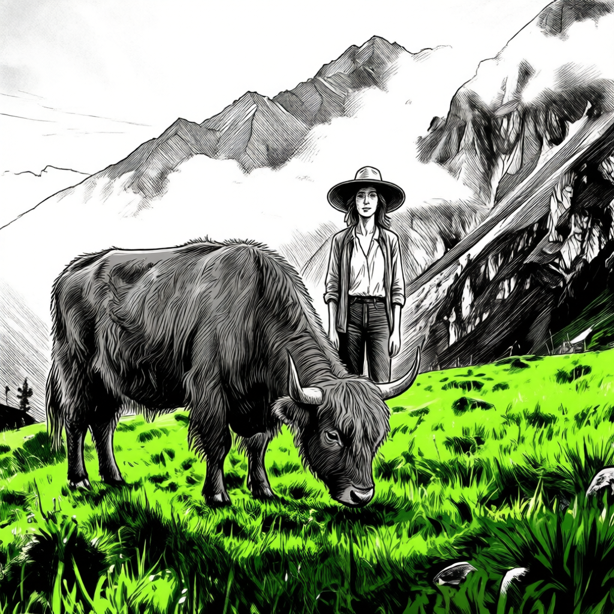
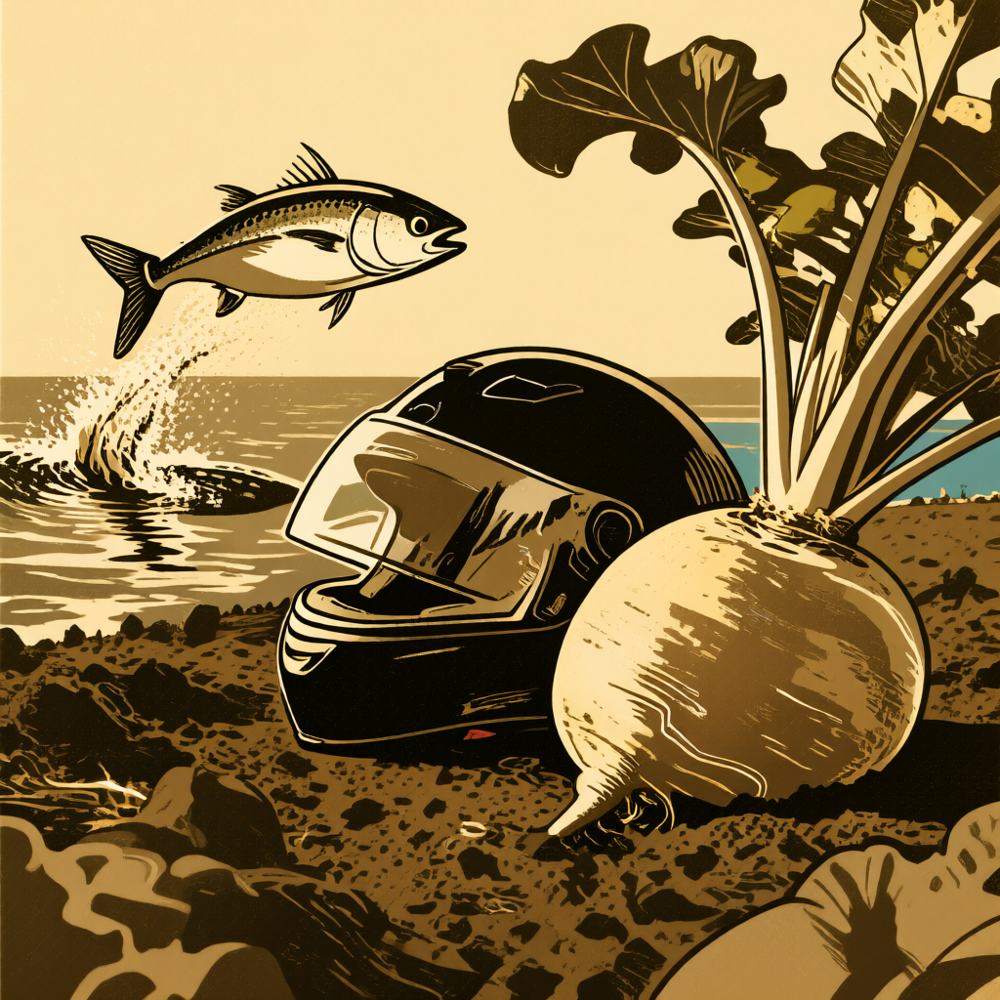
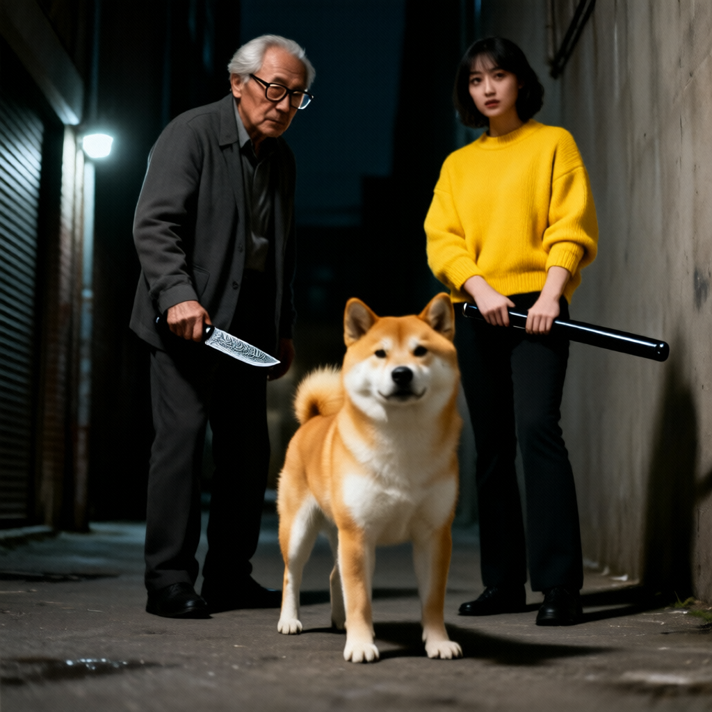

<div align="center">

# DyRef: Scaling Multi-Reference Image Generation with Dynamic Reward Optimization

Wenwang Huang<sup>1,\*</sup>, Yusen Fu<sup>1,\*</sup>, Junjie Wang<sup>1</sup>, Mengfei Huang<sup>1</sup>, Yulin Li<sup>1</sup>, Gan Liu<sup>2</sup>, Jing Cai<sup>2</sup>, Yancheng He<sup>2</sup>, Zhuotao Tian<sup>1,3,†</sup>

<sup>1</sup> Harbin Institute of Technology (Shenzhen),  
<sup>2</sup> The Chinese University of Hong Kong (Shenzhen),  
<sup>3</sup> Shenzhen Loop Area Institute,  
<sup>*</sup> Equal contribution · <sup>†</sup> Corresponding author

[](https://eccv.ecva.net/)
[](https://arxiv.org/abs/2606.26947)
[](LICENSE)
[](#results-gallery)
[](https://huggingface.co/datasets/Eason0438/OmniRef-Bench)
[](https://huggingface.co/datasets/Eason0438/OmniRef-training)
[](https://huggingface.co/Weistrass/Qwen-Image-Edit-2511-DyRef)

</div>

## Table of Contents

1. [News](#news)
2. [Todo List](#todo-list)
3. [Highlights](#highlights)
4. [Motivation](#motivation)
5. [Method](#method)
6. [Installation](#installation)
7. [Quickstart](#quickstart)
8. [Evaluation](#evaluation)
9. [Results Gallery](#results-gallery)
10. [Acknowledgement](#acknowledgement)
11. [Citation](#citation)

## News

- [2026.07.01] Refreshed the DyRef README with a FlashVID-style project page structure and a dedicated showcase section.
- [2026.07.01] Added a concise quickstart flow for SFT, weight conversion, RL, and evaluation.
- [2026.07.01] Reserved a gallery area for curated DyRef generations and future qualitative examples.

## Todo List

- [ ] Launch a standalone public project page.
- [ ] Add more curated samples to the results gallery.
- [ ] Release model checkpoints and stronger inference demos.
- [ ] Expand benchmark summaries with more quantitative tables.

## Highlights



1. DyRef is a two-stage training framework for multi-reference image generation.
2. It jointly handles heterogeneous references such as subject, style, background, lighting, and pose.
3. Stage 1 uses supervised fine-tuning with LoRA to learn multi-reference composition.
4. Stage 2 uses Flow-GRPO reinforcement learning with GDPO-style advantage estimation to improve alignment.
5. OmniRef-Bench provides a structured evaluation protocol across six dimensions.

## Motivation

Multi-reference image generation is difficult because the model must satisfy several control signals at once while keeping the final image coherent.

DyRef is built to address this challenge with a practical two-stage recipe:
- learn a strong initialization from supervised multi-reference data,
- then refine it with reward-guided post-training,
- and finally evaluate the model with a benchmark that covers multiple reference types rather than a single control axis.

## Method

DyRef follows a simple but effective pipeline:

1. **Stage 1: SFT**
   - Fine-tune a base image model with LoRA on multi-reference supervision.
   - Learn how to combine multiple heterogeneous references in one generation.
2. **Stage 2: RL**
   - Convert the LoRA weights into PEFT format.
   - Continue training with Flow-GRPO and GDPO-style advantage estimation.
   - Convert the trained weights back for inference and evaluation.
3. **Evaluation**
   - Generate images with the trained model.
   - Score them using OmniRef-Bench across subject, style, background, lighting, pose, and overall alignment.

## Installation

DyRef uses separate conda environments because the SFT, RL, and benchmark stacks rely on different dependencies.

### SFT Environment

```bash
cd sft
conda create -n dyref_sft python=3.11 -y
conda activate dyref_sft
pip install -e .
```

### RL Environment

```bash
cd rl
conda create -n dyref_rl python=3.11 -y
conda activate dyref_rl
pip install -e .[deepspeed]
# 还需要下载一些模型，dino, CSD环境， clip, siglip2

```

## Quickstart

### 1. Stage 1: SFT Training

```bash
conda activate dyref_sft
cd DyRef/sft
bash all_scripts/Qwen-Image-Edit-2511_lora.sh
```

### 2. Convert SFT Weights for RL

```bash
cd sft
python all_scripts/diffusers_peft_transfer.py --mode d2p \
    --input /path/to/sft_checkpoint.safetensors \
    --output /path/to/output_peft_format_dir \
    --prefix transformer \
    --verify
```

### 3. Stage 2: RL Training

```bash
conda activate dyref_rl
cd DyRef/rl
bash scripts/qwen2511-gdpo-rank64-add2k5-csd-siglipv2_flat-sigmoid0.65-focal_loss.sh
```

### 4. Convert RL Weights for Evaluation

```bash
cd sft
python all_scripts/diffusers_peft_transfer.py --mode p2d \
    --input /path/to/rl_checkpoint_dir \
    --output /path/to/output.safetensors \
    --prefix '' \
    --verify
```

### 5. Generate Images for Evaluation

```bash
cd sft
conda activate dyref_sft
bash all_scripts/eval/eval_ourbench_lora_2511.sh
```

### 6. Run OmniRef-Bench

```bash
cd benchmark
bash eval_suite.sh \
    /path/to/generated_images \
    /path/to/output_dir \
    /path/to/test_set \
    /path/to/test_set.json
```

For more details, see [benchmark/README.md](benchmark/README.md).

## Evaluation

OmniRef-Bench is designed to measure whether generated images preserve and combine multiple references in a balanced way.

The benchmark covers:
- Subject fidelity
- Style consistency
- Background consistency
- Lighting consistency
- Pose consistency
- Overall multi-reference alignment

The evaluation-related code is organized under:
- `benchmark/Grounded-SAM-2_patch/`
- `benchmark/CSD_patch/`
- `benchmark/AlphaPose_patch/`
- `benchmark/MLLM_eval/`

## Results Gallery

This section is reserved for polished DyRef generations.

### Selected Examples

<table>
  <tr>
    <td align="center">
      
      <br />
      <b>Case 1</b>
    </td>
    <td align="center">
      
      <br />
      <b>Case 2</b>
    </td>
  </tr>
  <tr>
    <td align="center">
      
      <br />
      <b>Case 3</b>
    </td>
    <td align="center">
      
      <br />
      <b>Case 4</b>
    </td>
  </tr>
</table>

### Gallery Notes

- Add more curated samples to `generate_results/` and reference them here.
- If you want a more project-page style gallery, place each output next to its input references.
- Keep this section focused on strong qualitative examples rather than exhaustive comparisons.

## Acknowledgement

DyRef is built on several excellent open-source projects:
- [DiffSynth-Studio](https://github.com/modelscope/diffsynth-studio) for SFT training infrastructure
- [Flow-Factory](https://github.com/X-GenGroup/Flow-Factory) for RL training infrastructure
- [Grounded-SAM-2](https://github.com/IDEA-Research/Grounded-SAM-2) for subject and background evaluation
- [CSD](https://github.com/learn2phoenix/CSD) for style consistency evaluation
- [AlphaPose](https://github.com/MVIG-SJTU/AlphaPose) for pose evaluation

## Citation

If you find DyRef useful in your research, please consider citing it:

- Paper: https://arxiv.org/abs/2606.26947

```bibtex
@article{dyref2025,
  title={DyRef: Scaling Multi-Reference Image Generation with Dynamic Reward Optimization},
  author={},
  journal={},
  year={2025}
}
```
