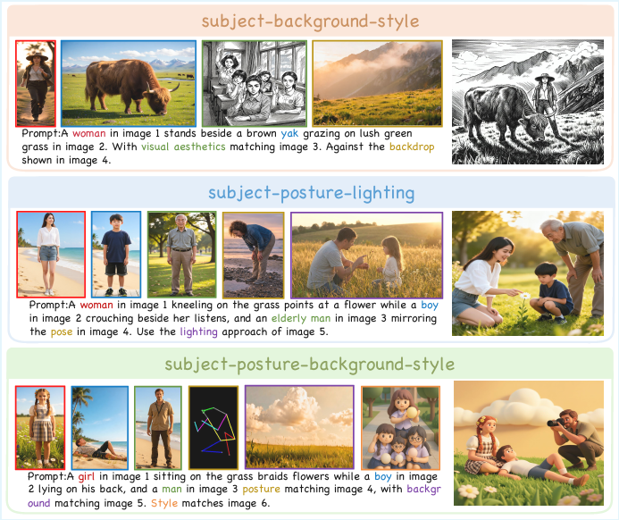
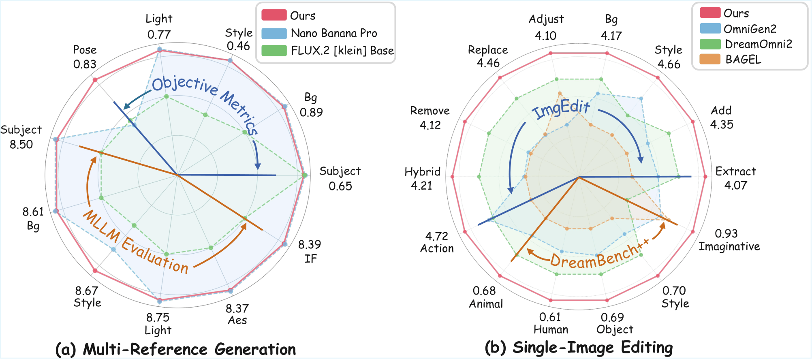
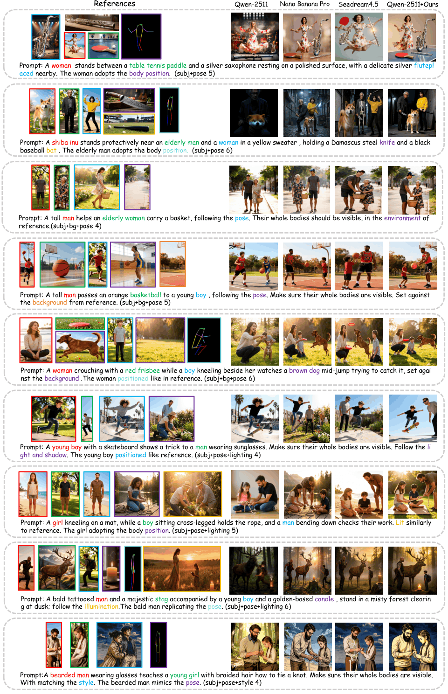
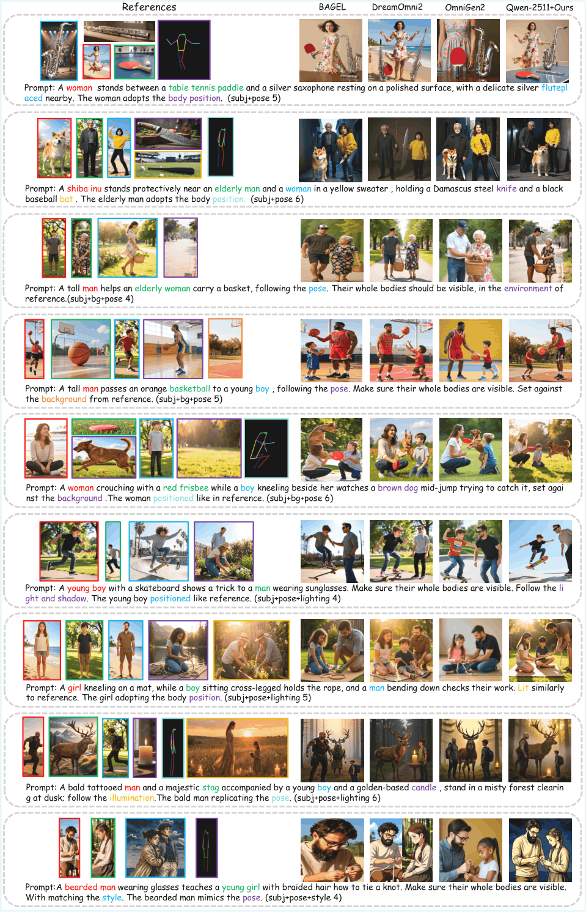
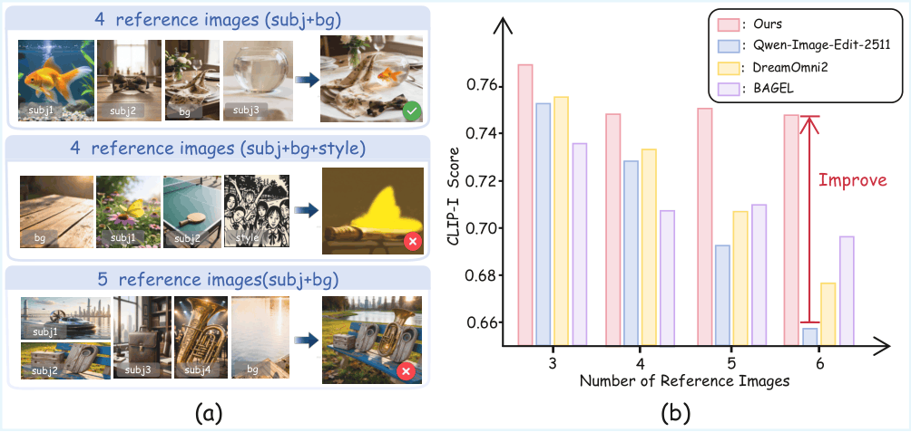
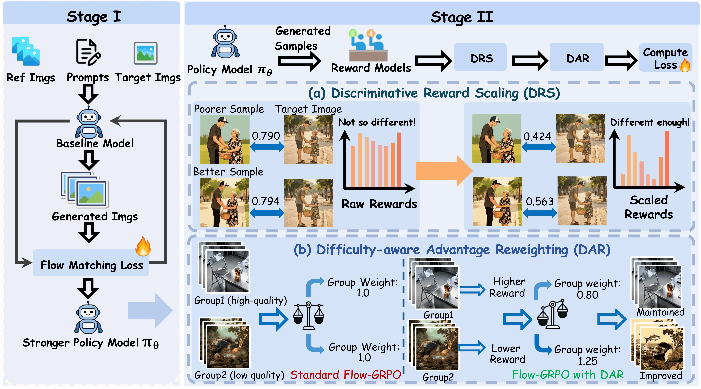

<div align="center">

# Scaling Multi-Reference Image Generation with Dynamic Reward Optimization

Wenwang Huang<sup>1,\*</sup>, Yusen Fu<sup>1,\*</sup>, Junjie Wang<sup>1</sup>, Mengfei Huang<sup>1</sup>, Yulin Li<sup>1</sup>, Gan Liu<sup>2</sup>, Jing Cai<sup>2</sup>, Yancheng He<sup>2</sup>, Zhuotao Tian<sup>1,3,†</sup>

<sup>1</sup> Harbin Institute of Technology, Shenzhen,  
<sup>2</sup> Independent Researcher,  
<sup>3</sup> Shenzhen Loop Area Institute,  
<sup>*</sup> Equal contribution · <sup>†</sup> Corresponding author

[](https://eccv.ecva.net/)
[](https://arxiv.org/abs/2606.26947)
[](LICENSE)
[](#results-gallery)
[](https://huggingface.co/datasets/Eason0438/OmniRef-Bench)
[](https://huggingface.co/datasets/Eason0438/OmniRef-training)
[](https://huggingface.co/Weistrass/Qwen-Image-Edit-2511-DyRef)

</div>

## 🔖 Table of Contents

1. [News](#news)
2. [Todo List](#todo-list)
3. [Highlights](#highlights)
4. [Results Gallery](#results-gallery)
5. [Motivation](#motivation)
6. [Method](#method)
7. [Installation](#installation)
8. [Quickstart](#quickstart)
9. [Evaluation](#evaluation)
10. [Acknowledgement](#acknowledgement)
11. [Citation](#citation)

## 🔥News

- [2026.06.18] Our paper has been accepted by ECCV 2026 🎉🎉🎉. Congratulations to all collaborators! 🎊🎊🎊
- [2026.07.02] We have released the training and inference code of DyRef, along with the corresponding training data, benchmark, and model weights. Feel free to use it! ⭐⭐⭐

## 📋Todo List

- [x] Release our paper on arXiv.
- [x] Open-source the training code of DyRef for Qwen-Image-Edit-2511, and Flux2-klein-base.
- [x] Release the training data used in our work.
- [x] Open-source OmniRef-Bench, our proposed benchmark.
- [x] Release the model weights trained by our method.
- [ ] Improve code efficiency and structure.
- [ ] Release the project page

## ✨Highlights

<p align="center">
  
</p>



1. We introduce [**OmniRef-Bench**](https://huggingface.co/datasets/Eason0438/OmniRef-Bench) to evaluate complex multi-reference image generation (MRIG) across diverse combinations of reference-image types and quantities. Our evaluation reveals that current open-source models still struggle substantially on this challenging benchmark.

2. We develop an automated data synthesis pipeline for complex MRIG and propose **DyRef** to address the sharp performance degradation of existing open-source models as reference complexity increases. Trained with DyRef, Qwen-Image-Edit-2511 achieves performance comparable to the closed-source model **Nano Banana Pro** and surpasses **Seedream 4.5**.

3. DyRef consistently enhances open-source models, including Qwen-Image-Edit-2511 and FLUX.2-klein-base, on MRIG benchmarks (**OmniRef-Bench**, **MultiBanana**, and **OmniContext**) while also improving single-image editing performance on **ImgEdit** and **DreamBench++**, without compromising the foundation models' other capabilities.

## 🖼️Results Gallery
In this part, we present qualitative comparisons between our method and existing approaches across various combinations of reference types. The prompts shown in the figures are abbreviated versions for visualization purposes and are not the actual prompts used during inference. In addition, we use color to indicate the attributes specified in the user prompt and their corresponding reference images.





## 💡Motivation


In this work, we observe that the performance of current mainstream open-source image generation models degrades substantially as the number of reference images increases and the diversity of reference types expands. This limitation significantly restricts their potential for professional applications, such as creative image generation and video keyframe generation.


## 🧩Method


**Illustration of DyRef**. To address this issue, we propose DyRef, a two-stage training framework. 

In Stage I, we employ SFT to equip the model with the basic capability to handle complex MRIG tasks. In Stage II, **(a) DRS** enlarges the reward differences across samples for better training, and **(b) DAR** enhances the model’s focus on samples with numerous mixed-type reference images.

## ⚙️Installation

DyRef uses separate Conda environments for SFT, RL, and benchmark evaluation because each component has its own dependency requirements.

### SFT Environment

```bash
conda create -n dyref_sft python=3.11 -y
conda activate dyref_sft
cd DyRef/sft
pip install -e .
```

### RL Environment

```bash
conda create -n dyref_rl python=3.11 -y
conda activate dyref_rl
cd DyRef/rl
pip install -e .[deepspeed]
```

### Model Download
Please download the following models from Hugging Face: 
- Qwen/Qwen-Image-Edit-2511
- google/siglip2-base-patch16-384
- facebook/dinov2-base
- openai/clip-vit-large-patch14
- black-forest-labs/FLUX.2-klein-base-9B (if you need)

For example:
```bash
hf download Qwen/Qwen-Image-Edit-2511 --local-dir "your path to save this model"
```

## 🚀Quickstart

### Model Inference
Before running the following command, please download the [Qwen-Image-Edit-2511](https://huggingface.co/Qwen/Qwen-Image-Edit-2511) model and the [pretrained LoRA weights](https://huggingface.co/Weistrass/Qwen-Image-Edit-2511-DyRef) we provide.

```bash
conda activate dyref_sft
python model_inference/Qwen-Image-Edit-2511.py
```

### Train
If you would like to train a model from scratch using your own data or reproduce our training pipeline, please run the following command.

#### 1. Stage 1: SFT Training

```bash
conda activate dyref_sft
cd DyRef/sft
bash all_scripts/Qwen-Image-Edit-2511_lora.sh
```

#### 2. Convert SFT Weights for RL
Since the original repositories used for SFT and RL training adopt different formats for storing LoRA weights, the following conversion script is required to ensure that the LoRA weights generated during the SFT stage can be correctly loaded during RL training.
```bash
cd DyRef/sft
python all_scripts/diffusers_peft_transfer.py --mode d2p \
    --input /path/to/sft_checkpoint.safetensors \
    --output /path/to/output_peft_format_dir \
    --prefix transformer \
    --verify
```

#### 3. Stage 2: RL Training

```bash
conda activate dyref_rl
cd DyRef/rl
bash scripts/qwen2511-gdpo-rank64-add2k5-csd-siglipv2_flat-sigmoid0.65-focal_loss.sh
```

## 📊Evaluation

OmniRef-Bench is designed to measure whether generated images preserve and combine multiple references in a balanced way.

The benchmark covers:
- Subject fidelity
- Style consistency
- Background consistency
- Lighting consistency
- Pose consistency
- Overall multi-reference alignment

The evaluation-related code is organized under:
- `benchmark/Grounded-SAM-2_patch/`
- `benchmark/CSD_patch/`
- `benchmark/AlphaPose_patch/`
- `benchmark/MLLM_eval/`

### 1. Convert RL Weights for Evaluation

```bash
cd DyRef/sft
python all_scripts/diffusers_peft_transfer.py --mode p2d \
    --input /path/to/rl_checkpoint_dir \
    --output /path/to/output.safetensors \
    --prefix '' \
    --verify
```

### 2. Generate Images for Evaluation

```bash
conda activate dyref_sft
cd DyRef/sft
bash all_scripts/eval/eval_ourbench_lora_2511.sh
```

### 3. Run OmniRef-Bench

```bash
cd benchmark
bash eval_suite.sh \
    /path/to/generated_images \
    /path/to/output_dir \
    /path/to/test_set \
    /path/to/test_set.json
```

For more details, see [benchmark/README.md](benchmark/README.md).

## 🙏Acknowledgement

DyRef is built on several excellent open-source projects:
- [DiffSynth-Studio](https://github.com/modelscope/diffsynth-studio) for SFT training infrastructure
- [Flow-Factory](https://github.com/X-GenGroup/Flow-Factory) for RL training infrastructure
- [Grounded-SAM-2](https://github.com/IDEA-Research/Grounded-SAM-2) for subject and background evaluation
- [CSD](https://github.com/learn2phoenix/CSD) for style consistency evaluation
- [AlphaPose](https://github.com/MVIG-SJTU/AlphaPose) for pose evaluation

## 📝Citation

If you find DyRef useful in your research, please consider citing it:

```bibtex
@article{huang2026scaling,
  title={Scaling Multi-Reference Image Generation with Dynamic Reward Optimization},
  author={Huang, Wenwang and Fu, Yusen and Wang, Junjie and Huang, Mengfei and Li, Yulin and Liu, Gan and Cai, Jing and He, Yancheng and Tian, Zhuotao},
  journal={arXiv preprint arXiv:2606.26947},
  year={2026}
}
```
